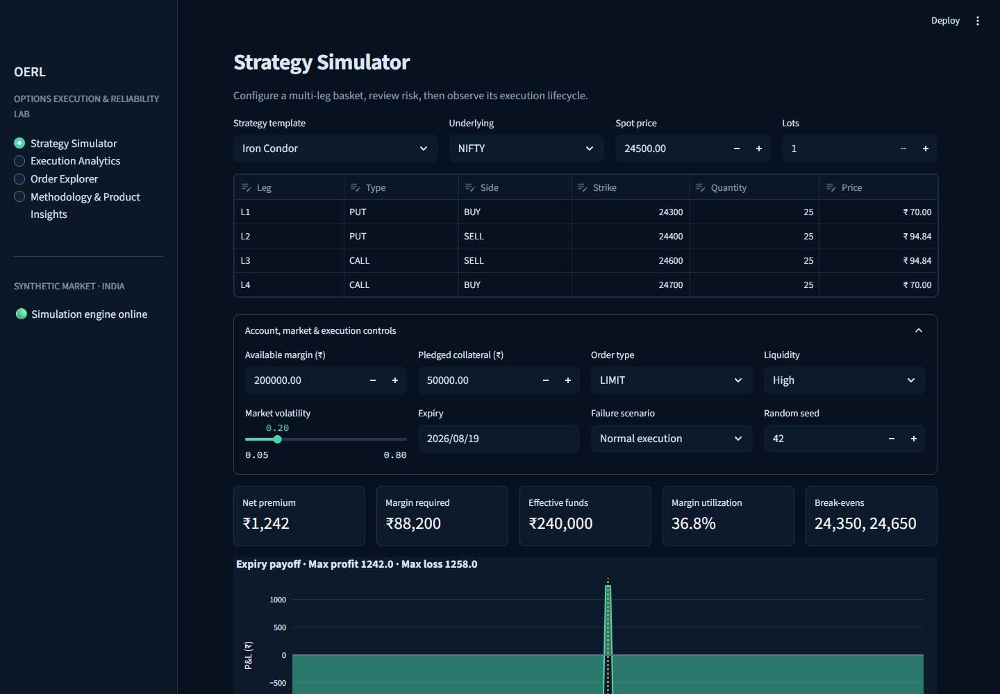
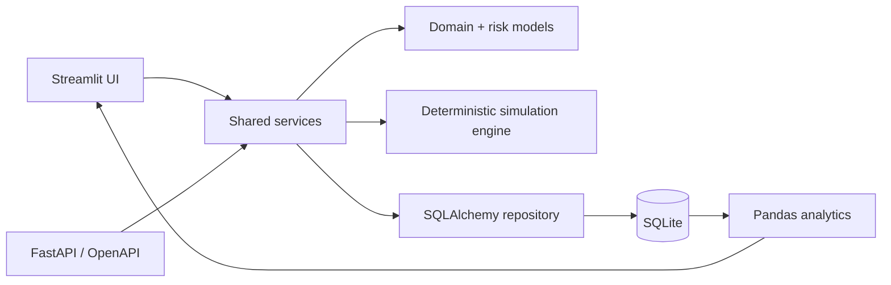

# Options Execution & Reliability Lab

> A dark-terminal product analytics lab for simulating and diagnosing multi-leg options execution reliability.

**Repository:** https://github.com/Brajesh250/options-execution-reliability-lab · **Live app:** Not deployed yet · **API docs:** `http://localhost:8000/docs`



## Why this exists

A basket order is one customer intent but many technical events. A stale quote, margin rejection, exchange timeout, or partial leg fill can turn a simple action into operational risk. This independent portfolio project makes that lifecycle visible without connecting to a broker or placing real trades.

## What it demonstrates

- Editable NIFTY/BANKNIFTY templates for iron condors, vertical spreads, straddles, and custom baskets
- Deterministic simulation of nine normal/failure scenarios with leg-level event timelines
- Pre-trade premium, margin, payoff, break-even, and bounded/unbounded risk analysis
- Filter-reactive funnel, completion, rejection, partial-fill, latency, and slippage analytics
- Searchable order/leg/event explorer with CSV export
- Shared Pydantic/service layer used by Streamlit and seven FastAPI endpoints
- SQLite persistence and an idempotent 1,600-order, 90-day synthetic seed generator
- 30 automated tests with 89.7% measured core coverage, Ruff CI, Docker, and OpenAPI

## Architecture



## Stack

Python 3.11+, Streamlit, FastAPI, Pydantic, SQLAlchemy, SQLite, Pandas, NumPy, Plotly, Pytest, Ruff, GitHub Actions, Docker.

## Run locally

```bash
python -m venv .venv
# Windows: .venv\Scripts\activate
# macOS/Linux: source .venv/bin/activate
pip install -r requirements.txt
python -m src.database.seed
streamlit run streamlit_app.py
```

In another terminal:

```bash
uvicorn src.api.main:app --reload
```

Quality checks:

```bash
pip install pytest pytest-cov httpx ruff
ruff check .
pytest --cov --cov-report=term-missing
```

Docker: `docker compose up --build` starts the UI at port 8501 and API at port 8000.

## Metrics

- Basket completion = completed baskets / submitted baskets
- Strategy abandonment = unsubmitted builds / builds started
- Leg fill = filled legs / submitted legs
- Partial-fill and rejection rates use submitted baskets as denominator
- Buy slippage = fill − reference; sell slippage = reference − fill
- P95 latency = 95th percentile basket latency; zero denominators safely return zero

## Product insights

The methodology page calculates five observations directly from the current synthetic dataset. The primary designed patterns are worse tail latency and completion in low liquidity, more adverse price slippage for market orders, concentrated failures above 100% margin utilization, and residual exposure after partial execution.

## Limitations and next steps

This is an educational simulator, not an OMS or pricing model. It omits order-book depth, Greeks, live volatility surfaces, exact SPAN margin, fees/taxes, exchange calendars, and broker connectivity. A production iteration would add quote-age telemetry, exchange reconciliation, residual-delta controls, trace IDs, SLO alerts, and calibrated market replay.

## Documentation

- [Product requirements](docs/PRD.md)
- [Architecture](docs/ARCHITECTURE.md)
- [Data dictionary](docs/DATA_DICTIONARY.md)
- [Metric definitions](docs/METRICS.md)
- [Testing](docs/TESTING.md)
- [Portfolio case study](docs/PORTFOLIO_CASE_STUDY.md)

## Author

Brajesh B. Mohanty · GitHub and LinkedIn URLs to be added only after verification.

## Disclaimer

Educational execution simulation using synthetic data. Not investment advice. No real orders are placed. Independent portfolio project—not affiliated with Nubra or any broker.

MIT licensed.
