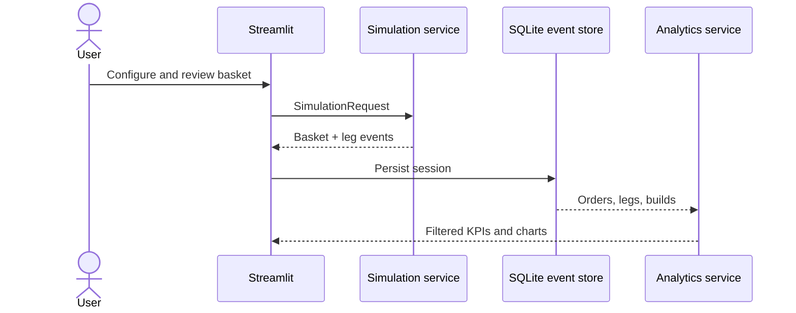

# Architecture

## Layers

- `domain`: validated requests/results, templates, payoff and margin rules
- `simulation`: deterministic lifecycle and scenario state machine
- `services`: transaction boundary and basket persistence
- `database`: normalized SQLAlchemy schema and reproducible seed
- `analytics`: safe metric formulas and filter helpers
- `api`: FastAPI transport and OpenAPI
- `ui`: Streamlit pages and shared dark theme

Both transports import the same domain and service modules. SQLite is initialized on process start; Streamlit idempotently seeds it when fewer than 1,600 demo orders exist. The generated database is ignored by Git, so ephemeral hosts rebuild it.

## Reliability and security

No secrets or external APIs are required. Deterministic UUIDs make retries idempotent. Pydantic validates boundaries, SQLAlchemy manages transactions, zero denominators are safe, and CI enforces lint/tests/coverage. Production would add authentication, migrations, Postgres, distributed traces, async queues, and exchange reconciliation.
