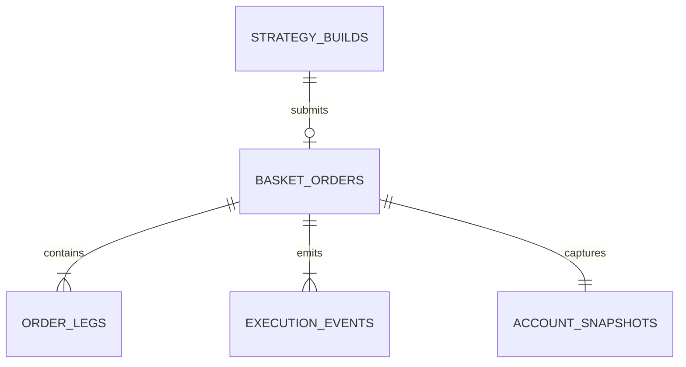

# Data Dictionary

| Table | Grain | Important fields |
|---|---|---|
| `strategy_builds` | One strategy-building session | `build_id`, `session_id`, timestamp, strategy, underlying, reviewed, submitted |
| `basket_orders` | One submitted basket | `order_id`, build/session IDs, strategy, market controls, final status, margin utilization, latency, slippage, exposure, recommendation |
| `order_legs` | One option leg per basket | `leg_id`, status, requested/fill price, filled quantity, adverse slippage, latency, rejection reason |
| `execution_events` | One lifecycle transition | `event_id`, timestamp, session/order/leg IDs, event name, status, step latency, metadata/reason |
| `account_snapshots` | One account state per basket | available margin, pledged collateral, margin consumed |

Times are stored as UTC-naive SQLite datetimes after creation in UTC. Currency values are educational INR approximations. `metadata_json` is extensible event context.
